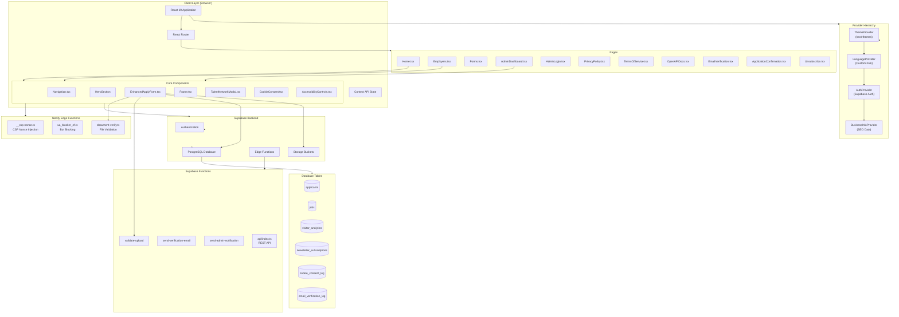
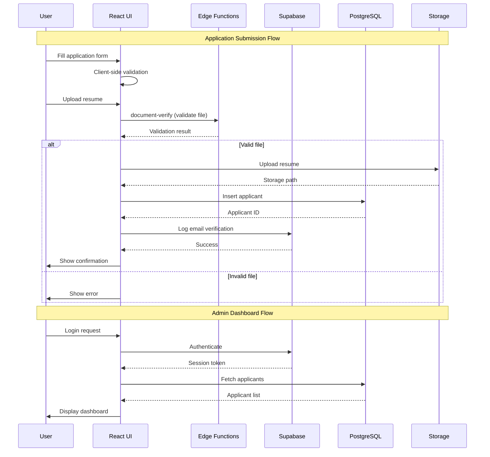
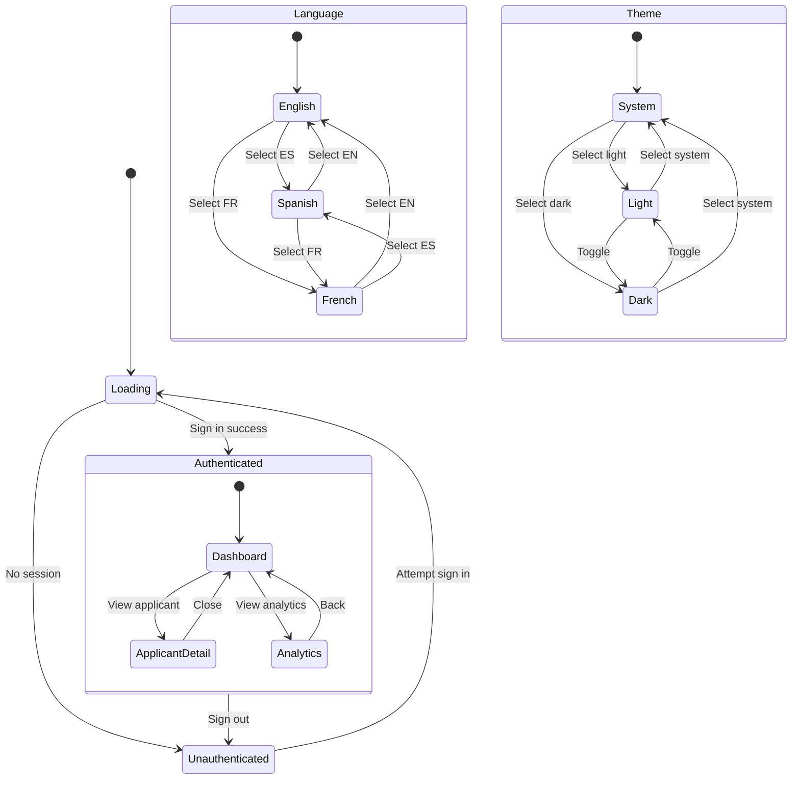
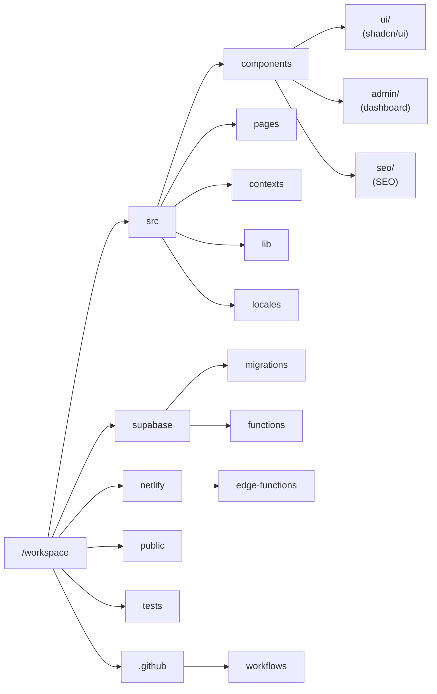
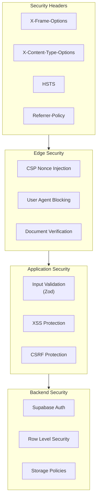

# Codebase Architecture Diagram

## System Architecture

```mermaid
flowchart TB
    subgraph Client["Client Layer (Browser)"]
        React["React 19 Application"]
        Router["React Router"]
        State["Context API State"]
        Components["UI Components"]
    end

    subgraph Providers["Provider Hierarchy"]
        Theme["ThemeProvider<br/>(next-themes)"]
        Lang["LanguageProvider<br/>(Custom i18n)"]
        Auth["AuthProvider<br/>(Supabase Auth)"]
        Business["BusinessInfoProvider<br/>(SEO Data)"]
    end

    subgraph Pages["Pages"]
        Home["Home.tsx"]
        Employers["Employers.tsx"]
        Forms["Forms.tsx"]
        Admin["AdminDashboard.tsx"]
        AdminLogin["AdminLogin.tsx"]
        Privacy["PrivacyPolicy.tsx"]
        Terms["TermsOfService.tsx"]
        APIDocs["OpenAPIDocs.tsx"]
        Verify["EmailVerification.tsx"]
        Confirm["ApplicationConfirmation.tsx"]
        Unsubscribe["Unsubscribe.tsx"]
    end

    subgraph Components["Core Components"]
        Nav["Navigation.tsx"]
        Hero["HeroSection"]
        Apply["EnhancedApplyForm.tsx"]
        Footer["Footer.tsx"]
        Modal["TalentNetworkModal.tsx"]
        Cookie["CookieConsent.tsx"]
        A11y["AccessibilityControls.tsx"]
    end

    subgraph Netlify["Netlify Edge Functions"]
        CSP["__csp-nonce.ts<br/>CSP Nonce Injection"]
        UA["ua_blocker_ef.ts<br/>Bot Blocking"]
        DocVerify["document-verify.ts<br/>File Validation"]
    end

    subgraph Supabase["Supabase Backend"]
        SupaAuth["Authentication"]
        SupaDB["PostgreSQL Database"]
        SupaStorage["Storage Buckets"]
        SupaFn["Edge Functions"]
    end

    subgraph SupaFunctions["Supabase Functions"]
        API["api/index.ts<br/>REST API"]
        SendEmail["send-verification-email"]
        AdminNotify["send-admin-notification"]
        Validate["validate-upload"]
    end

    subgraph Database["Database Tables"]
        Applicants[(applicants)]
        Jobs[(jobs)]
        Analytics[(visitor_analytics)]
        Newsletter[(newsletter_subscriptions)]
        Consent[(cookie_consent_log)]
        EmailLog[(email_verification_log)]
    end

    %% Client connections
    React --> Router
    Router --> Pages
    React --> Providers
    Providers --> Theme
    Theme --> Lang
    Lang --> Auth
    Auth --> Business

    %% Page components
    Home --> Components
    Admin --> Components
    Employers --> Components

    %% External connections
    Components --> Netlify
    Components --> Supabase
    
    Supabase --> SupaAuth
    Supabase --> SupaDB
    Supabase --> SupaStorage
    Supabase --> SupaFn
    
    SupaFn --> SupaFunctions
    SupaDB --> Database

    %% Form submission flow
    Apply --> DocVerify
    Apply --> Validate
    Apply --> SupaDB
    Apply --> SupaStorage
```

## Component Hierarchy

```mermaid
graph TD
    App["App.tsx"]
    
    App --> ThemeProvider
    App --> LanguageProvider
    App --> AuthProvider
    App --> BusinessInfoProvider
    App --> BrowserRouter
    
    BrowserRouter --> Routes
    
    Routes --> HomePage["/ Home"]
    Routes --> EmployersPage["/employers"]
    Routes --> FormsPage["/forms"]
    Routes --> AdminLoginPage["/admin/login"]
    Routes --> AdminDashPage["/admin/dashboard"]
    Routes --> PrivacyPage["/privacy"]
    Routes --> SMSPrivacyPage["/privacy/sms"]
    Routes --> TermsPage["/terms"]
    Routes --> APIDocsPage["/developers/api/docs"]
    Routes --> VerifyPage["/verify-email"]
    Routes --> ConfirmPage["/application-confirmation"]
    Routes --> UnsubPage["/unsubscribe"]
    Routes --> ServicePage["/service-area"]
    
    HomePage --> Navigation
    HomePage --> HeroSection
    HomePage --> AboutSection
    HomePage --> ServicesSection
    HomePage --> ClientLogos
    HomePage --> EnhancedApplyForm
    HomePage --> ContactSection
    HomePage --> Footer
    
    AdminDashPage --> ApplicantTable
    AdminDashPage --> ApplicantFilters
    AdminDashPage --> ApplicantDetailDialog
    AdminDashPage --> ApplicantStats
    AdminDashPage --> AnalyticsDashboard
```

## Data Flow

```mermaid
sequenceDiagram
    participant User
    participant UI as React UI
    participant EF as Edge Functions
    participant Supabase
    participant DB as PostgreSQL
    participant Storage

    Note over User, Storage: Application Submission Flow
    
    User->>UI: Fill application form
    UI->>UI: Client-side validation
    User->>UI: Upload resume
    UI->>EF: document-verify (validate file)
    EF-->>UI: Validation result
    
    alt Valid file
        UI->>Storage: Upload resume
        Storage-->>UI: Storage path
        UI->>DB: Insert applicant
        DB-->>UI: Applicant ID
        UI->>Supabase: Log email verification
        Supabase-->>UI: Success
        UI->>User: Show confirmation
    else Invalid file
        UI->>User: Show error
    end

    Note over User, Storage: Admin Dashboard Flow
    
    User->>UI: Login request
    UI->>Supabase: Authenticate
    Supabase-->>UI: Session token
    UI->>DB: Fetch applicants
    DB-->>UI: Applicant list
    UI->>User: Display dashboard
```

## State Management

```mermaid
stateDiagram-v2
    [*] --> Loading
    Loading --> Authenticated: Sign in success
    Loading --> Unauthenticated: No session
    
    Unauthenticated --> Loading: Attempt sign in
    Authenticated --> Unauthenticated: Sign out
    
    state Authenticated {
        [*] --> Dashboard
        Dashboard --> ApplicantDetail: View applicant
        ApplicantDetail --> Dashboard: Close
        Dashboard --> Analytics: View analytics
        Analytics --> Dashboard: Back
    }
    
    state Language {
        [*] --> English
        English --> Spanish: Select ES
        English --> French: Select FR
        Spanish --> English: Select EN
        Spanish --> French: Select FR
        French --> English: Select EN
        French --> Spanish: Select ES
    }
    
    state Theme {
        [*] --> System
        System --> Light: Select light
        System --> Dark: Select dark
        Light --> Dark: Toggle
        Light --> System: Select system
        Dark --> Light: Toggle
        Dark --> System: Select system
    }
```

## Deployment Pipeline

```mermaid
flowchart LR
    subgraph Development
        Code["Code Changes"]
        Lint["ESLint"]
        TypeCheck["TypeScript"]
        Build["Vite Build"]
    end
    
    subgraph CI["GitHub Actions"]
        PRCheck["PR Checks"]
        SecurityScan["Security Scan"]
        AIReview["AI Code Review"]
    end
    
    subgraph Deployment
        NetlifyDeploy["Netlify Deploy"]
        EdgeFn["Edge Functions"]
        CDN["CDN Distribution"]
    end
    
    subgraph Production
        Site["Production Site"]
        SupabackEnd["Supabase Backend"]
    end
    
    Code --> Lint
    Lint --> TypeCheck
    TypeCheck --> Build
    Build --> PRCheck
    PRCheck --> SecurityScan
    SecurityScan --> AIReview
    AIReview --> NetlifyDeploy
    NetlifyDeploy --> EdgeFn
    EdgeFn --> CDN
    CDN --> Site
    Site --> SupabackEnd
```

## File Structure

```mermaid
graph LR
    Root["/workspace"]
    
    Root --> src
    Root --> supabase
    Root --> netlify
    Root --> public
    Root --> tests
    Root --> github[".github"]
    
    src --> components
    src --> pages
    src --> contexts
    src --> lib
    src --> locales
    
    components --> ui["ui/<br/>(shadcn/ui)"]
    components --> admin["admin/<br/>(dashboard)"]
    components --> seo["seo/<br/>(SEO)"]
    
    supabase --> migrations
    supabase --> functions
    
    netlify --> edgeFn["edge-functions"]
    
    github --> workflows
```

## Security Layers

```mermaid
flowchart TB
    subgraph Edge["Edge Security"]
        CSPNonce["CSP Nonce Injection"]
        UABlock["User Agent Blocking"]
        DocVerify["Document Verification"]
    end
    
    subgraph App["Application Security"]
        InputValidation["Input Validation<br/>(Zod)"]
        XSSProtection["XSS Protection"]
        CSRFProtection["CSRF Protection"]
    end
    
    subgraph Backend["Backend Security"]
        Auth["Supabase Auth"]
        RLS["Row Level Security"]
        StorageRules["Storage Policies"]
    end
    
    subgraph Headers["Security Headers"]
        XFrame["X-Frame-Options"]
        XContent["X-Content-Type-Options"]
        HSTS["HSTS"]
        Referrer["Referrer-Policy"]
    end
    
    Edge --> App
    App --> Backend
    Headers --> Edge
```
