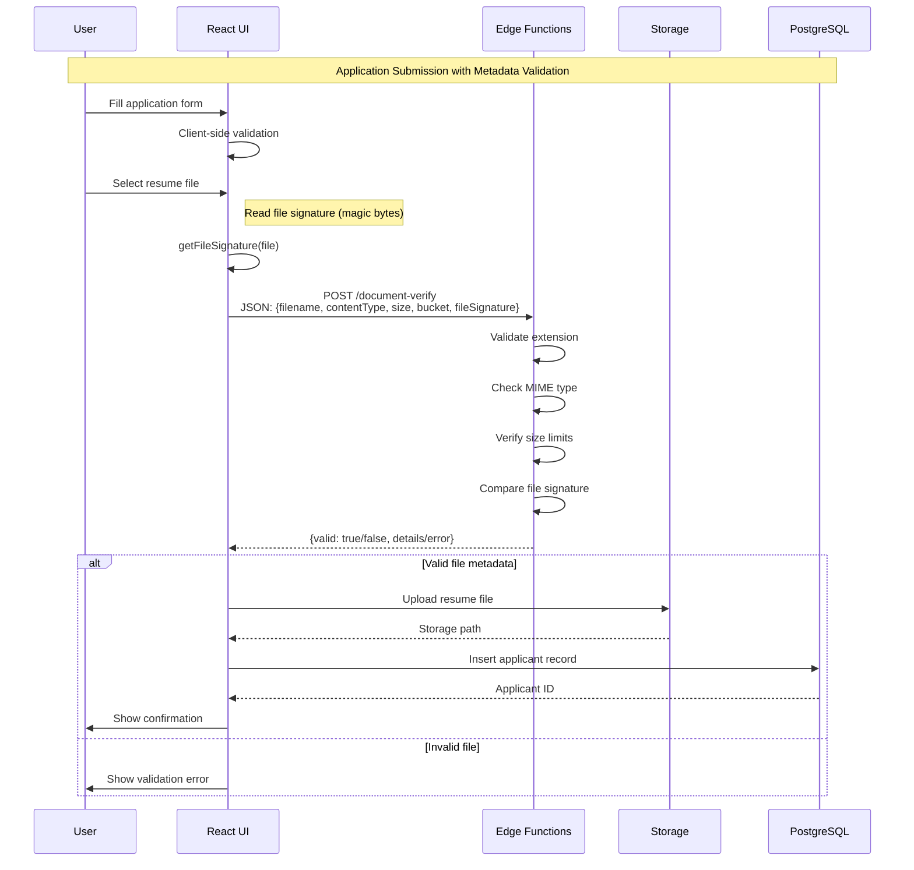
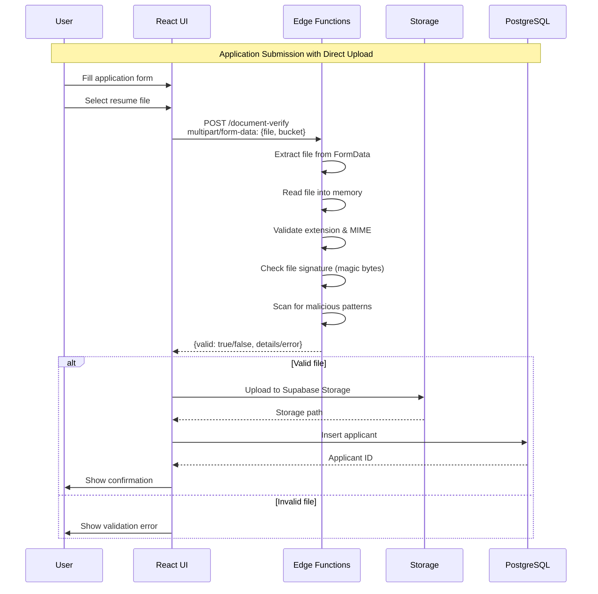
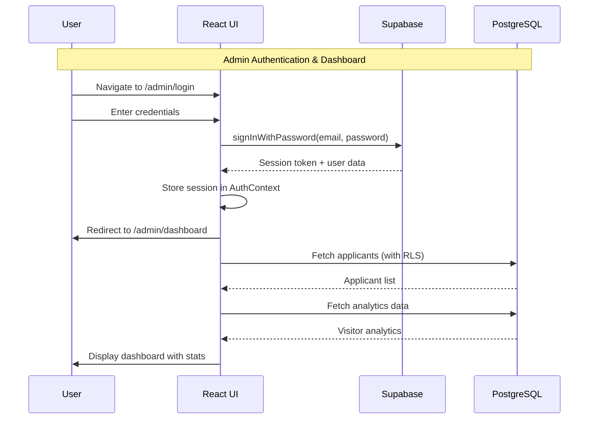

# Codebase Architecture Diagram

## System Architecture

## Component Hierarchy

## Data Flow

### Flow 1: Metadata-First Validation (Current Implementation)

This flow validates file metadata (type, size, signature) via JSON before upload:

### Flow 2: Direct File Upload Validation (Alternative)

This flow uploads the file directly to the edge function for validation:

### Admin Dashboard Flow

## State Management

## Deployment Pipeline

## File Structure

## Security Layers

