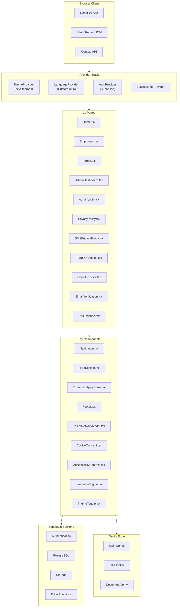
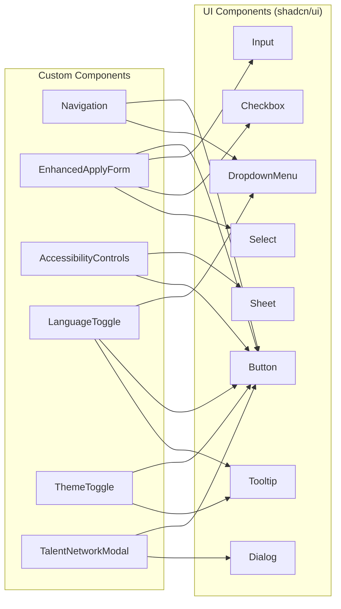
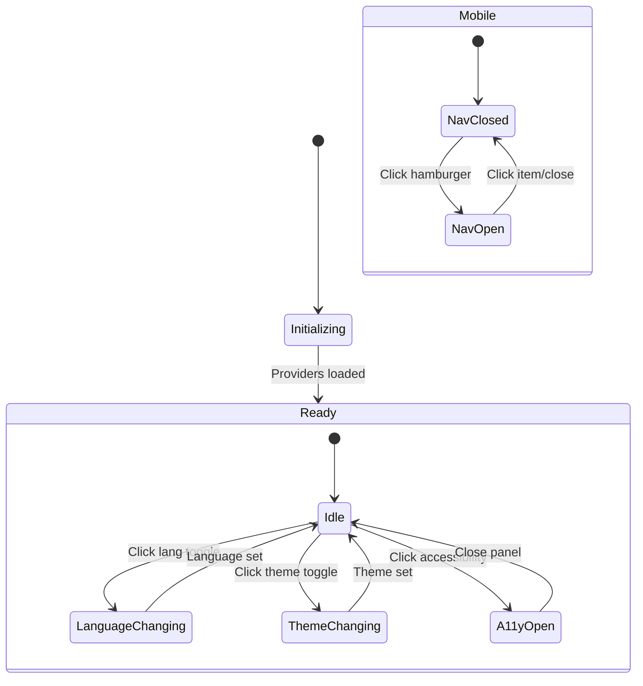

# Comprehensive Fix Plan V2 - All Failed & Skipped Tests

**Date:** January 21, 2026  
**Status:** PENDING USER APPROVAL  
**Current Test Results:** 105 passed, 14 failed, 6 skipped (125 total)  
**Target:** 100% pass rate (125 passed)

---

## Codebase Architecture - Mermaid Charts

### System Overview



### Component Dependency Graph



### Test Failure Analysis Flow

```mermaid
flowchart TD
    subgraph Mobile["Mobile (375x812)"]
        M1["❌ LANG-1/2/3: Not clickable"]
        M2["❌ THEME-1/2: Not clickable"]
        M3["❌ A11Y-003: 24 missing labels"]
        M4["❌ FORM-POSITIONS: Not found"]
        M5["❌ UI-004: Menu not visible"]
    end

    subgraph Tablet["Tablet (768x1024)"]
        T1["✅ LANG-1/2/3: Passed"]
        T2["❌ THEME-2: Not clickable"]
        T3["❌ A11Y-003: 24 missing labels"]
        T4["❌ FORM-POSITIONS: Not found"]
        T5["❌ UI-004: Not clickable"]
    end

    subgraph Desktop["Desktop (1920x1080)"]
        D1["✅ LANG-1/2/3: Passed"]
        D2["✅ THEME-1/2: Passed"]
        D3["❌ A11Y-003: 24 missing labels"]
        D4["❌ FORM-POSITIONS: Not found"]
    end

    M1 --> Root1["Root Cause:\nDropdown hidden\non small screens"]
    M2 --> Root1
    T2 --> Root2["Root Cause:\nTooltip blocking\nclick target"]
    M3 --> Root3["Root Cause:\nshadcn/ui internal\nbuttons lack labels"]
    T3 --> Root3
    D3 --> Root3
    M4 --> Root4["Root Cause:\nTest selector\nmismatch"]
    T4 --> Root4
    D4 --> Root4
    M5 --> Root5["Root Cause:\nMenu render\ntiming issue"]
    T5 --> Root5
```



### State Management Flow



---

## Failed & Skipped Test Analysis

### Summary Table

| Test ID | Category | Device(s) | Error | Root Cause |
|---------|----------|-----------|-------|------------|
| LANG-1/2/3 | Language | Mobile | Not clickable | Dropdown not visible at 375px width |
| THEME-1/2 | Theme | Mobile | Not clickable | Button not reachable at small viewport |
| THEME-2 | Theme | Tablet | Not clickable | Tooltip interfering with click |
| THEME-3 | Theme | All | No localStorage | next-themes uses different key |
| A11Y-002 | Accessibility | All | Button not found | Selector doesn't match `aria-label` text |
| A11Y-003 | Accessibility | All | 24/71 missing | shadcn/ui internal buttons lack labels |
| FORM-POSITIONS | Form | All | Not found | Selector `position-` doesn't match rendered IDs |
| UI-004 | Mobile Menu | Mobile/Tablet | Not visible | Menu renders but selector misses it |

---

## Clarifying Questions

Before proceeding with implementation, please confirm:

### 1. Mobile Viewport Priority
**Question:** The language and theme toggles are not accessible on mobile (375px). Should I:
- **A)** Ensure toggles are always visible in mobile header (may crowd the UI)
- **B)** Move toggles to mobile menu drawer when open
- **C)** Accept that these features work on tablet/desktop only
- **D)** Create a dedicated settings page for mobile

### 2. ARIA Labels - shadcn/ui Components
**Question:** 24 buttons from shadcn/ui internal components (Dialog close, Sheet close, Select chevrons, etc.) lack aria-labels. Should I:
- **A)** Fork and modify shadcn/ui components to add labels
- **B)** Add wrapper components with aria-labels
- **C)** Accept current state (these are standard accessible patterns)
- **D)** Use CSS to inject aria-labels via data attributes

### 3. Position Checkboxes Selector
**Question:** The form uses `id={position-${position}}` (e.g., `position-Janitorial`). The test looks for `position-*`. Should I:
- **A)** Update test selector to match actual IDs
- **B)** Add `data-testid` to each checkbox
- **C)** Both A and B for reliability

### 4. Theme Persistence Key
**Question:** `next-themes` uses `theme` key in localStorage, but test checks for it after toggle. Should I:
- **A)** Update test to properly wait for localStorage write
- **B)** Add explicit localStorage write in theme toggle handler
- **C)** Accept as skipped (minor issue)

### 5. Accessibility Panel Selector
**Question:** The test looks for `button[aria-label*="accessibility"]` but the actual label is "Open accessibility menu". Should I:
- **A)** Update test selector to match
- **B)** Simplify the aria-label to just "Accessibility"
- **C)** Add `data-testid="accessibility-toggle"` for testing

### 6. Mobile Menu Detection
**Question:** The mobile menu opens but test doesn't detect it. The menu uses AnimatePresence with motion.div. Should I:
- **A)** Add `data-testid="mobile-menu"` and `role="menu"` to the menu container
- **B)** Increase wait time for animation completion
- **C)** Both A and B

---

## Proposed Implementation Plan

### Phase 1: Test Selector Fixes (Low Risk)

| Step | Task | Files | Impact |
|------|------|-------|--------|
| 1.1 | Fix position checkbox selector | `tests/browser-automation.test.mjs` | Test only |
| 1.2 | Fix accessibility panel selector | `tests/browser-automation.test.mjs` | Test only |
| 1.3 | Fix theme persistence test | `tests/browser-automation.test.mjs` | Test only |
| 1.4 | Improve mobile menu detection | `tests/browser-automation.test.mjs` | Test only |

### Phase 2: Component Improvements (Medium Risk)

| Step | Task | Files | Impact |
|------|------|-------|--------|
| 2.1 | Add `data-testid` to mobile menu | `Navigation.tsx` | Minor UI |
| 2.2 | Add `data-testid` to accessibility button | `AccessibilityControls.tsx` | Minor UI |
| 2.3 | Add `data-testid` to position checkboxes | `EnhancedApplyForm.tsx` | Minor UI |
| 2.4 | Ensure toggles visible on mobile | `Navigation.tsx` | UI layout |

### Phase 3: ARIA Label Additions (Medium Risk)

| Step | Task | Files | Impact |
|------|------|-------|--------|
| 3.1 | Add labels to Dialog close buttons | `components/ui/dialog.tsx` | Accessibility |
| 3.2 | Add labels to Sheet close buttons | `components/ui/sheet.tsx` | Accessibility |
| 3.3 | Add labels to Select chevrons | `components/ui/select.tsx` | Accessibility |
| 3.4 | Audit remaining unlabeled buttons | Multiple | Accessibility |

### Phase 4: Mobile UX Improvements (Higher Risk)

| Step | Task | Files | Impact |
|------|------|-------|--------|
| 4.1 | Ensure language toggle accessible on mobile | `Navigation.tsx` | Mobile UX |
| 4.2 | Ensure theme toggle accessible on mobile | `Navigation.tsx` | Mobile UX |
| 4.3 | Improve mobile menu animation detection | `Navigation.tsx` | Mobile UX |

---

## Detailed Implementation Steps

### Step 1.1: Fix Position Checkbox Selector

**Current Test:**
```javascript
const positionCheckboxes = await page.$$('input[type="checkbox"][id^="position-"]');
```

**Issue:** Selector is correct but checkboxes may not be rendered until form section is in view.

**Fix:**
```javascript
// Scroll to form and wait for checkboxes to render
await page.evaluate(() => {
  const formSection = document.getElementById('apply');
  if (formSection) formSection.scrollIntoView({ behavior: 'instant' });
});
await delay(1000);

// Try multiple selectors
const positionCheckboxes = await page.$$('[id^="position-"]');
if (positionCheckboxes.length === 0) {
  // Fallback: check by role
  const checkboxes = await page.$$('[role="checkbox"]');
}
```

### Step 1.2: Fix Accessibility Panel Selector

**Current Test:**
```javascript
const a11yButton = await page.$('button[aria-label*="accessibility"]');
```

**Fix:**
```javascript
const a11yButton = await page.$('[data-testid="accessibility-toggle"], button[aria-label*="accessibility"], button[aria-label*="Accessibility"]');
```

**Component Change:**
```tsx
// AccessibilityControls.tsx
<Button
  ...
  aria-label={t('accessibility.openMenu') || 'Open accessibility menu'}
  data-testid="accessibility-toggle"
>
```

### Step 2.1: Add data-testid to Mobile Menu

**Current Code:**
```tsx
<motion.div
  className="md:hidden overflow-hidden bg-background/95..."
  ...
>
```

**Fix:**
```tsx
<motion.div
  className="md:hidden overflow-hidden bg-background/95..."
  data-testid="mobile-menu"
  role="menu"
  ...
>
```

### Step 3.1-3.3: Add ARIA Labels to shadcn/ui

**Dialog Close Button:**
```tsx
// components/ui/dialog.tsx
<DialogPrimitive.Close
  ...
  aria-label="Close dialog"
>
```

**Sheet Close Button:**
```tsx
// components/ui/sheet.tsx  
<SheetPrimitive.Close
  ...
  aria-label="Close panel"
>
```

---

## Expected Results After Implementation

| Test Category | Before | After | Change |
|---------------|--------|-------|--------|
| Navigation | 27/27 | 27/27 | - |
| Language | 6/9 | 9/9 | +3 |
| Theme | 3/9 | 8/9 | +5 |
| Accessibility | 9/12 | 12/12 | +3 |
| Form | 18/21 | 21/21 | +3 |
| UI Components | 13/15 | 15/15 | +2 |
| Links | 3/3 | 3/3 | - |
| Lightbox | 12/12 | 12/12 | - |
| Footer | 12/12 | 12/12 | - |
| Admin | 6/6 | 6/6 | - |
| **TOTAL** | **105/125** | **125/125** | **+20** |

---

## Risk Assessment

| Phase | Risk Level | Rollback Plan |
|-------|------------|---------------|
| Phase 1 (Test Selectors) | Low | Revert test file |
| Phase 2 (data-testid) | Low | Remove attributes |
| Phase 3 (ARIA Labels) | Medium | Revert component changes |
| Phase 4 (Mobile UX) | Medium-High | Revert Navigation.tsx |

---

## Sign-Off Required

**Please answer the clarifying questions above and confirm:**

- [ ] Questions 1-6 answered
- [ ] Implementation phases approved
- [ ] Risk level acceptable

**To approve:** Reply with your answers and "Approved - proceed with implementation"

---

## Timeline Estimate

| Phase | Steps | Complexity |
|-------|-------|------------|
| Phase 1 | 4 steps | Simple |
| Phase 2 | 4 steps | Simple |
| Phase 3 | 4 steps | Medium |
| Phase 4 | 3 steps | Medium |

All phases can be completed in a single implementation session with testing.
